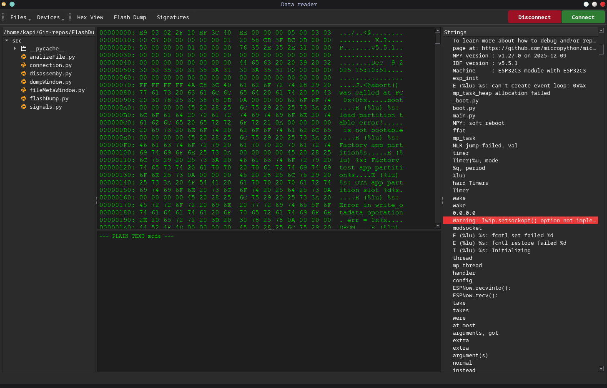

# Dokumentacja projetu: * Embedded debugger *

## Zespoł projetowy:
_Kacper Zoła_

## Opis projektu
Narzędzie pomagające w debagowaniu i analizie danych z systemów wbudowanych, IoT. 
Pozwala na wyciąganie firmware, analize bajtów wyciągniętego pliku, komunikacje z systemami poprzez 
protokół UART, wyszukiwanie ciągów znaków z pliku binarnego, analize metadanych.

## Zakres projektu opis funkcjonalności:
- Komunikacje z modułami wbudowanymi (UART)
- Wyciąganie firmware z modułów
- Analize bajtów wyciągniętego pliku (ale i każdego innego)
- Wyszukiwanie ciągów znaków w danym pliku
- Analize metadanych pliku
- Prezentacja funkcjonalności w wygodny i intuicyjny sposób poprzez GUI

## Panele / zakładki aplikacji

- Główne okno:
    - Pasek narzędzi
    - Drzewo plików
    - Edytor (Hex viewer)
    - Terminal
    - Panel ciągów znaku (strings)
- Okno metadanych pliku
- Okno do ściągania firmware 

## Wykorzystane biblioteki:
- PyQt6    -> GUI
- Thread   -> do odbierania danych z protokołu UART, jednocześnie nie zakłucając działania reszty aplikacji
- hexdump  -> analiza plików w systemie hexdecimal
- pyserial -> komunikacja poprzez protokół UART z płytkami
- esptools -> wydobywanie firmware procesorów platformy ESP32
- pylink   -> JTAG/SWD wydobywanie firmware procesorów Arm Cortex M (w trakcie)
- re       -> analiza ciągów znaków w danych binarnych
- os       -> wydobywanie metadanych plików oraz drzewo plików w otwartym folderze

## Instrukcja uruchomienia aplikacji
Aplikacje można uruchomić poprzez użycie interpretera python na plik _main.py_.

## Możliwości rozwojowe
Wdrożenie biblioteki pyOcd i wsparcie dla bardziej "obszerengo" typu kontrolerów, szersze wspracie protokołu JTAG